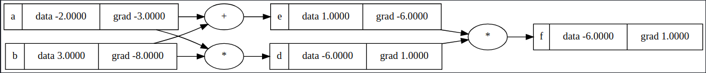

### Multi Layer Perceptron with Scalars

This project implements a Multi Layer Perceptron (MLP) using scalar operations, inspired by the work of Andrej Karpathy. The goal is to create a simple neural network and understand the fundamentals of backpropagation and gradient optimization operations.

## Project Structure

The project is divided into two main parts:

1. **Engine**: Contains the implementation of gradient calculation through the `Value` class.
2. **Neural Network**: Contains the implementation of classes to build and train the MLP.

### Engine

The `Value` class is used to represent scalar numbers and their basic operations (addition, multiplication, etc.) while tracking gradients for backpropagation.

**Main functions in the `Value` class:**

- `__add__`: Adds two values.
- `__mul__`: Multiplies two values.
- `__pow__`: Raises a value to a scalar power.
- `relu`: ReLU activation function.
- `tanh`: Tanh activation function.
- `backward`: Computes gradients using backpropagation.

### Neural Network

The `Neuron`, `Layer`, and `MLP` classes are used to build the neural network. The network is composed of neurons organized in layers and uses activation functions like ReLU and Tanh.

**Main functions:**

- `Neuron`: Represents a single neuron in a layer.
- `Layer`: Represents a layer of neurons.
- `MLP`: Represents the Multi Layer Perceptron, composed of multiple layers.

### Training

The MLP is trained using stochastic gradient descent (SGD) with support for different loss functions, such as SVM "max-margin" loss and Mean Squared Error (MSE).

**Training function:**

- `train`: Trains the MLP with support for early stopping based on patience.

### Example Usage

```python
import numpy as np
from micrograd.engine import Value
from micrograd.neuralNetwork import MLP

# Example data
X = np.array([[0.5, -1.5], [-1.0, 2.0], [1.5, -0.5]])
y = np.array([1, -1, 1])

# Model initialization
model = MLP(2, [16, 16, 1], "tanh")  # Neural network with 2 inputs, 2 hidden layers of 16 neurons each, and 1 output

# Model training
model.train(X, y, epochs=100, patience=10, loss_type="svm")
```

### Ploting

The `plot.py` file contains functions to plot the operation graph of the model (recommended for small models).

```python
from micrograd.engine import Value
from micrograd.plot import draw_dot

a = Value(-2.0, label='a')
b = Value(3.0, label='b')
d = a*b; d.label = 'd'
e = a+b; e.label = 'e'
f = d*e; f.label = 'f'

f.backward()

draw_dot(f)
```



### License

This project is licensed under the MIT License - see the [LICENSE](LICENSE) file for details.

## Acknowledgments

This project was inspired and based on the work by Andrej Karpathy. You can find the original repository [aqui](https://github.com/karpathy/micrograd).
Additionally, I recommend watching the [video on YouTube](https://youtu.be/VMj-3S1tku0?si=21Ke9QS85Y7yA4Cx).
